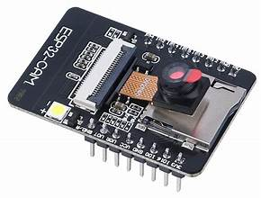
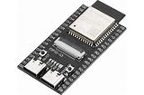

# Cave Diving Robot Technical Manual
### This robot uses the arduino uno and arduino components for all the electical work, the servo motors controlling the arm, the dc motors controling vertical movement, the ESP32-WROOM for communication with the joysticks, the ESP32-CAMERAs for sight of the cave, and the bread board for all the connections. All these parts are all controlled by the arduino uno, and all the mechanical parts are controlled by the arduino uno parts.

# Table of content
### 1. Technical Parts of the Body
### 2. Technical Parts of the Arms

# 1. Technical Parts of the Body
### The body is what the arms branch off of and what allows for vertical movement of the arms. The body also allows vision of the cave and wireless transmision to the controller.

## Vision
### The body uses the camera ESP32-CAM which is a camera that is compatable with the arduino uno. This camera uses wifi to transmit its imaging online for the user to see, and to view said imaging you must input and IP adress that is provided.

### The highest resolution of the camera is 1600 by 1200 pixles. On the website there will be many settings for the camera such as the contrast.
### The camera can't have an website without wifi which is why the ESP32-WROOM which is a wifi module is needed.

### The ESP32-WROOM can make its own wifi service for the camera to use.

## Vertical Movement by the Body
### For verticle movement there are four different circles each controlled by a DC motor.
### For each DC motor to move the ESP32-WROOM gets data from another ESP32-WROOM which is a part of the controller.
### The DC motors move by the Arduino Uno processing the data from the ESP32-WROOM and sending a analog voltage to the DC motors. The analog voltage controls speed instead of the DC motors either going full speed or not going at all.

# 2. Technical Parts of the Arms
### The point of the arm is for horizontal and vertical movement.

# Horizontal movement
### There are two joins for horizontal movement, kind of like an human arm with the wrist and elbow.
### There are two servo motors one for both joints, each servo motor is connected to a string that pulls and pushes the arms, and the hinges allow for such movement.
### There is a sickle shape on the top to dig into the rock for horizontal movement.

# Vertical movement by the arms
### As said in the Vertical movement by the body section there are four circles each circle controlling one arm, these circles allow for the arms to move up and down.
### [Click here to go back up to that section](#verticle-movement-by-the-body)
### The arms do the same thing as they do for horizontal movement to go up.
