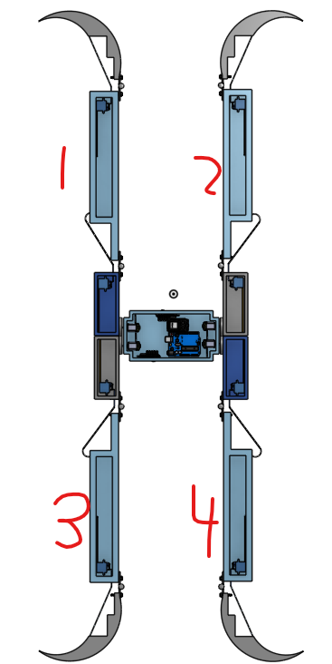

# Cave-diving-Robot
## The robot's purpose is to traverse tight and narrow caves that humans can't explore and relay video. This robot was designed with four arms for with vertical and horizontal movement. It can traverse more areas then a car because of its upward mobility. The cave diving robot comes with two cameras to help navigate forwards and backwards. The robot embeds its own programable arduino for customizing. 

# Safety
### a. This robot requires batteries and contains electronic equipment, when use take precaution and never put the appliance in water or any liquid.
### b. When the robot is not in action please remove the battery for safety.
### c. Avoid contact with moving parts.
### d. Be aware of exposed plastic wires that one may trip on.
### e. Enter caves at your own risk.

# Table of content
1. [Use + Use Cases](#use--use-cases)
   
2. [Disassembly](#disassembly)
   
3. [How to program/customize](#how-to-programcustomize)
   
4. [Power requirements](#power-requirements)

# 1. Use + Use Cases
## Use
### The robot's multiple componets are all controlled by joysticks.
### This robot will wirelessly send signals to the arduino uno. 
### There are going to be two different websites that you must keep track of, both of these are IP adresses, which correspond to front and back cameras.
### There will be one joystick per arm and there will be one joystick for the vertical movement of all four arms.
### For joystick1 (Vertical movement) move the joystick up for arm 1 (Top left), down for arm 2 (Top right), left for arm 3 (bottom left), and right for arm 4 (top left)
### For all arms, moving the joystick up and down will control the first joint, and side to side will control the second joint.
### Each joystick will be labeled from 0-4. 0 being vertical and 1-4 being each arm.

## Use cases
### The main use and what this robot was designed for is to navigate small caves that is impossible for humans to explore. 
### This robot can also be used for small spaces in general, like when exploring a pipe or when exploring beneath a house.
### But remember, this robot can only be used with caves a little less than its wing span.

# 2. Disassembly
### The top of the robot is screwed in, so remove the top for arduino/electronic component access. 
### If desired, remove or replace by unscrewing the screws on each hinge.

# 3. How to program/customize
### Once you have opened the top you will see an arduino uno. 
### To reprogram this board use a USB-B -> USB cable, connect the USB-B to the USB-B port on the arduino and the USB to the USB port on your computer.
### Then you must download Arduino IDE, which you can find on the arduino website. 
### Once the IDE is open and installed start coding!
### For the board to get your code you must press upload which looks like an arrow. 
### LINK: https://www.arduino.cc/en/software/

# 4. Power requirements
### To power the board you must have two 9V batteies and one battery snap with DC barrel plug, connect the DC barrel plugs to the DC power jack on the arduino unos.
